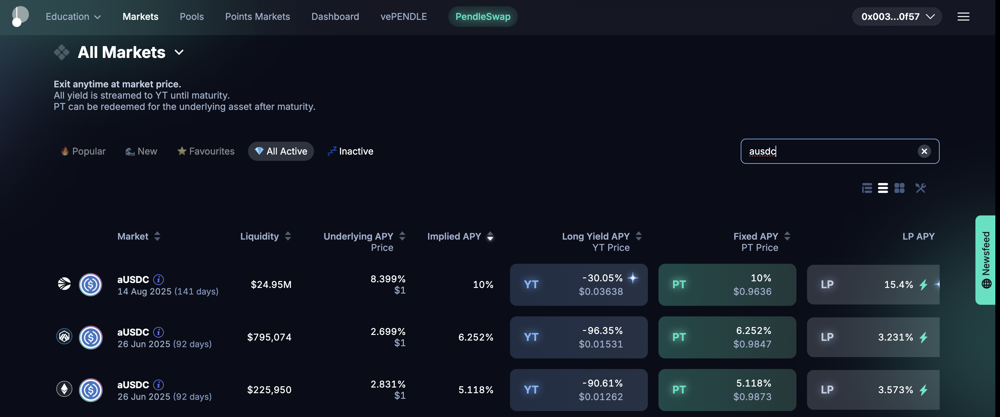

# Pendle Finance Demo UI

## Overview
This is a simplified demo UI for Pendle Finance, a DeFi yield trading platform. The application showcases how users can interact with fixed yield products, liquidity pools, and yield trading markets in a user-friendly interface.

## Features
- **Beginner/Advanced Mode Toggle**: Users can switch between simplified and advanced views based on their familiarity with DeFi.
- **Fixed Yield Markets**: Lock in guaranteed returns by holding until maturity.
- **Liquidity Pools**: Earn fees by providing liquidity to yield trading markets.
- **Yield Trading**: Buy and sell future yields to optimize returns.
- **Quest System**: Complete tasks to track progress and earn rewards.

## Tech Stack
- **Frontend**: React with TypeScript, TailwindCSS
- **State Management**: React Context API
- **Routing**: Wouter
- **UI Components**: Radix UI, Lucide React Icons

## Screenshot


## Development
To run the application locally:

```bash
# Install dependencies
npm install

# Start the development server
npm run dev
```

The application will be available at http://localhost:5000

## Deployment
The application can be deployed directly through Replit's deployment features, which will serve the built React application.

## License
MIT
