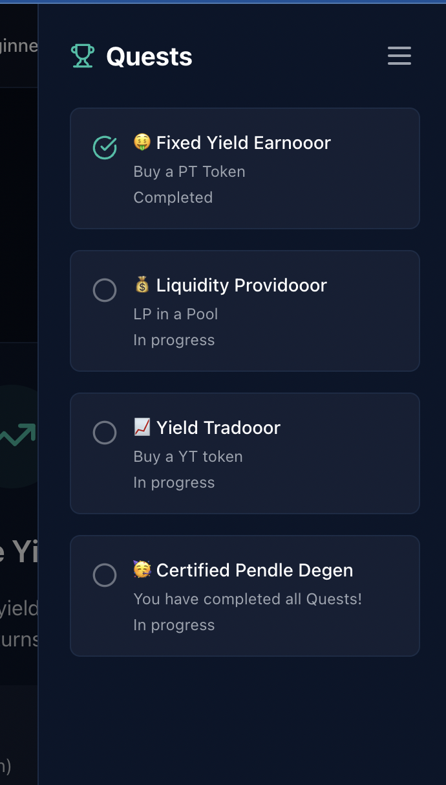

# Pendle Finance Demo UI

## Overview
This is a simplified demo UI for Pendle Finance, a DeFi yield trading platform. The application showcases how first-time users and beginners  can interact with Pendle in a simplified, user-friendly interface.

## Features
- **Beginner/Advanced Mode Toggle**: Users can switch between simplified and advanced views based on their familiarity with DeFi.
- **Simplified Product Offerings**: Users can choose one of three products, to simplify the UI and UX.
- **Quest System**: Gamified Quests incentivize users to try different types of transactions, track progress, and earn rewards.

## Screenshots

### Homepage


### Quest System


## Tech Stack
- **Frontend**: React with TypeScript, TailwindCSS
- **State Management**: React Context API
- **Routing**: Wouter
- **UI Components**: Radix UI, Lucide React Icons


## Development
To run the application locally:

```bash
# Install dependencies
npm install

# Start the development server
npm run dev
```

The application will be available at http://localhost:5000

## Deployment
The application can be deployed directly through Replit's deployment features, which will serve the built React application.

## License
MIT
